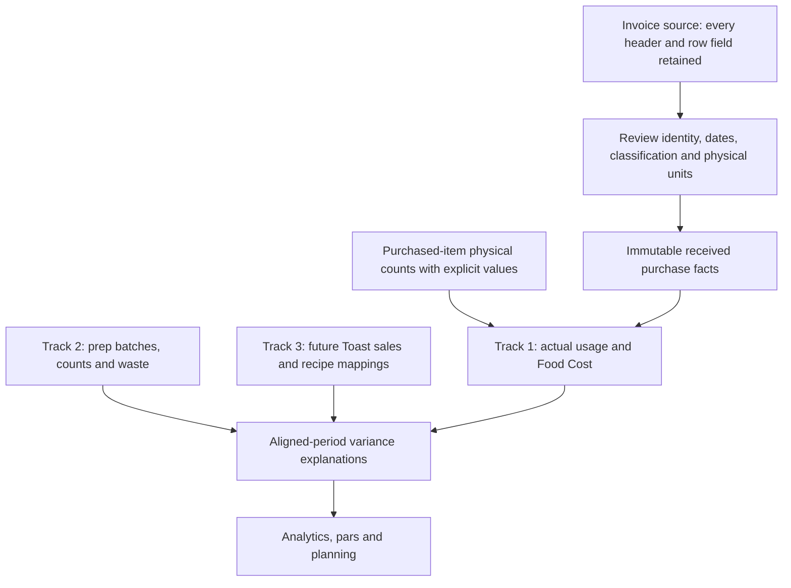

# Inventory foundation: completed work and remaining workflow

October 6, 2026. Cumulative draft PR checkpoint against `main` at
`1a5e97243009a922d38596d6559c6d9be7f6b5f3`.

## Purpose and publication boundary

The original inventory app mixed compatibility mappings, mutable stock, current prices, prep
deductions, and partially acknowledged browser saves. This checkpoint adds reviewed PostgreSQL
facts and independent inventory tracks, preserves invoice evidence, and makes covered saves and
shared catalog links explicit. It includes the cumulative implementation, migrations, tests,
design contracts, and the full original review reconciliation.

This is a review checkpoint, not a release. The PR stays draft and unmerged. No operational
database was changed and no real invoice was imported during this work. Local testing used
disposable PostgreSQL and invented fixtures. Future development starts on a separate local branch
from this checkpoint and will be submitted in a later PR. Login/PIN redesign, Toast ingestion,
Scheduling, Operations, and expanded Analytics remain future builds.

## Agreed inventory relationships

| Track | Recorded facts and calculation | Role |
|---|---|---|
| 1 — Actual purchased inventory | Opening purchased-item count + received purchases − closing purchased-item count. Explicit opening/closing count values plus eligible received purchase costs establish actual Food Cost. | Accounting baseline. Purchased items only; no physically counted prep items in this scope. |
| 2 — Prep and waste | Reviewed preparation inputs, yields, batches, prepared counts, opening sources, and waste support count-to-count usage and expected inventory explanations. | Internal planning and variance analysis beneath Track 1. No accounting writeback. |
| 3 — Sales | Future Toast portions sold, versioned recipe/portion mappings, corrections, and coverage support theoretical consumption. | Explain Track 1 and Track 2, inform pars and waste analysis. No accounting writeback. |

**Date received is the purchase date of record for inventory.** Invoice dates are still retained.
Taxes and fees remain separate from inventory cost and are preserved for a future module.
Current catalog prices cannot replace explicit count values or rewrite saved purchase facts.
Prep usage, waste, or sales explanations cannot deduct from or revalue Track 1.

Reports must distinguish complete measurement from partial coverage. Prep batch costs currently
remain `null` / `not_calculated`; a complete analytical costing policy has not been selected.
An incomplete recipe, unknown price, or missing event must not become an apparently trusted zero.

## Completed implementation

### 1. Retained invoice sources and reviewed purchase posting

Native intake retains raw source headers, rows, and unmapped fields alongside normalized facts.
PFG and US Foods sample exports informed the field contract; their actual invoice data was not
imported or committed as test data. Exact decimal financial values, supplier identity, received
dates, credits/returns, nonfood classification, taxes, and fees are retained. Reviewed mapping
and immutable posting separate evidence from accounting facts. Corrections preserve lineage
instead of silently rewriting a posted invoice.

Manual purchase entry and source attachments support review when a supplier export is unavailable.
Native mode holds competing legacy purchase writes. Less common invoice identities, splits,
discounts, and adjustments still require the acceptance work listed below.

Read [native purchase import](NATIVE_PURCHASE_IMPORT.md),
[manual purchase sources](MANUAL_PURCHASE_SOURCES.md), and
[posted invoice corrections](POSTED_INVOICE_CORRECTIONS.md).

### 2. Physical counts and immutable actual reporting

Purchased-item full physical counts use reviewed scope, confirmed physical conversions, and
explicit values. Count corrections, reopened-period lineage, period closure, and saved report
snapshots preserve the original facts and their replacement history. Scope handoffs make
changes between count periods explicit. Prep/sales deductions and mutable catalog prices cannot
change native actual usage or saved Food Cost.

Inventory displays identify the date of the count position. An old count is not advertised as
live on-hand stock. Owner and AI summaries avoid inventing raw stock from theoretical movements.
Staff count drafts are submitted for manager review with confirmed scope and units.

Read [Actual Inventory](ACTUAL_INVENTORY.md),
[corrections](ACTUAL_INVENTORY_CORRECTIONS.md),
[scope handoffs](ACTUAL_INVENTORY_SCOPE_HANDOFFS.md),
[operating views](NATIVE_OPERATING_VIEWS.md), and
[staff count drafts](STAFF_COUNT_DRAFTS.md).

### 3. Physical unit profiles and invoice-linked order receiving

Native purchase/count unit profiles are independently reviewed at each store. Supplier packs,
physical count units, fixed accounting bases, and service portions are separate concepts.
Legacy portion factors and edited catalog metadata cannot override verified physical facts.
Receiving links existing posted invoice facts once, with explicit order/supplier matching and
shortfall/overage handling; it does not create a second purchase or stock deduction. Receipt
reconciliation retains correction and historical unit provenance.

Read [units and receiving](NATIVE_UNITS_AND_ORDER_RECEIVING.md),
[receipt reconciliation](PO_RECEIPT_RECONCILIATION.md), and
[entry boundaries](NATIVE_ENTRY_BOUNDARIES.md).

### 4. Prep quantity journals and count-to-count explanations

Reviewed prepared-product and recipe versions establish inputs, outputs, yields, and units.
Native batches retain immutable movements and nested-prep provenance, with transactional writes,
request replay, quantity limits, and cycle checks. Waste and physical prep observations are
separate journal facts. Sealed analytical periods, explicit opening-source provenance, and
period scope continuity support comparisons without writing to actual accounting inventory.

These journals are a foundation, not a completed replacement for every legacy prep task,
container, staff count, and service screen. Their guarded native paths do not close the wider
operating cutover findings. Batch costs remain uncalculated.

Read [mapping foundation](PREP_MAPPING_FOUNDATION.md),
[batch journal](PREP_BATCH_JOURNAL.md),
[waste and counts](PREP_WASTE_AND_COUNTS.md),
[count periods](PREP_COUNT_PERIODS.md),
[opening sources](PREP_OPENING_SOURCES.md), and
[period journal](PREP_PERIOD_JOURNAL.md).
The [prep/waste design](PREP_WASTE_LEDGER_DESIGN.md) and
[Toast comparison rules](TOAST_COMPARISON_RULES.md) describe intended future relationships.

### 5. Native backup and disposable recovery checks

Native backup captures the application database, including private schemas and retained source
history, with dump digests and restore verification. Disposable restores compare rows,
schema/ACL structure, reporting results, and write guards. The legacy browser JSON export is
blocked from substituting for native recovery. This proves specified local fixtures; managed
production recovery, storage, scheduling, operator access, and deployment roles still need a
rehearsal. Database cluster roles/passwords are not a complete part of this application backup.

Read [backup and recovery](NATIVE_BACKUP_RECOVERY.md).

### 6. Acknowledged browser saves and retained drafts

Covered collection saves and forms require a valid acknowledgement before announcing success
or clearing input. Restaurant/session generations guard delayed responses, including leaving
and returning to the same store. Overlapping replacements and overtaken reads are held.
Polling preserves dirty sales drafts and their original revision. Prep settings require an
explicit save rather than per-keystroke writes. Partial legacy invoice outcomes are disclosed
and held for reconciliation rather than silently resubmitted.

Drafts live in memory during the signed-in App session. They do not persist across logout,
reload, or browser restart. Direct legacy operating API callers and broader backend concurrency
remain open work. Read [save and draft integrity](SAVE_AND_DRAFT_INTEGRITY.md).

### 7. Catalog metadata and explicit shared product linkage

Catalog round trips preserve separate active/count/order/sales settings, exact supplier text,
canonical IDs, explicit null values, price strings, and supplied count actors. Unknown planning
prices stay unknown. Unchanged prices retain their provenance; manual changes do not pretend to
be invoice facts. Retirement preserves purchasing/count history and physical scope.

Global purchased products and vendor/SKU relationships now support an explicit reviewed link
to another store. Each store owns its alias, flags, par, count settings, supplier preference,
availability, and price/provenance independently. Composite foreign keys pin the supplier SKU
to the correct product and store membership. Linking creates no stock, count value, invoice,
accounting base, or reviewed physical conversion profile.

No product is merged automatically by name. Existing store-prefixed `items.code` values remain
stable canonical identities; local aliases are separate. Ordinary store edits hold shared
global product/pack changes pending a dedicated amendment workflow. Catalog locks, revisions,
catalog hashes, atomic failure checks, and guarded order lines protect the covered commands.

Read [catalog integrity](CATALOG_INTEGRITY_FOUNDATION.md) and
[shared catalog mapping](SHARED_CATALOG_MAPPING.md).

## PostgreSQL and remaining Mongo references

The backend PostgreSQL paths use `asyncpg` and native relational tables/journals. Mongo-shaped
browser objects and older mapping functions remain compatibility scaffolding. The checkpoint
does not claim all Mongo references or competing legacy operating paths have been removed.

The measured cutover is to settle each canonical field/unit contract, route its supported
commands and reads directly through PostgreSQL, verify round trips and failures, then retire
the equivalent old writer. Avoid parallel authoritative stock or price stores. Stable identity,
immutable source facts, explicit corrections, store-local settings, and shared period boundaries
prevent accounting and theoretical explanations from drifting into competing balances.

## Validation recorded for this checkpoint

| Evidence | Result | Scope and limit |
|---|---|---|
| Current frontend run | 226 passing checks / 28 suites | Save/draft, native entry and shared catalog coverage; component tests, not a live browser walkthrough. |
| Current production frontend build | Passed | Three existing hook dependency warnings in PurchaseOrdersTab, SchedulingTab, and StaffTab. Build success is not a deployment. |
| Current selected backend run | 32 passing checks | Catalog, native receiving, and entry regressions; includes nine shared catalog checks. Not the entire backend suite. |
| Final focused backend reruns | Two passing checks | Legacy price-fallback guard and SKU mapping constraint; repeated checks, not two additional unique tests. |
| Current offline route/migration run | 23 passing checks | Selected offline contracts; not managed-service migration acceptance. |
| Fresh synthetic backup/restore | Passed | Purchased-inventory fixture: whole loaded database rows/schema/ACL, independent store supplier settings, and equal actual accounting reports. Does not load every prep schema. |
| Retained earlier prep/recovery proof | Passed in earlier milestones | Includes a synthetic restore of 16 private prep tables and earlier prep tests; not rerun in the latest catalog milestone. |
| Source checkpoint | 143 cumulative source paths hash-verified before publication documentation | 20,388 additions / 339 deletions against baseline before the checkpoint README/review files. |

The cumulative local evidence archive is retained outside the repository:
`JayMax-shared-catalog-2026-10-06-review-package.zip`, SHA-256
`20ba0f8ec5fbfe4bfa3629f21adf441766eecc861d653adc0a9eae90eac6fb96`.
It contains prior snapshots, current test output, source hashes, a cumulative patch, and synthetic
restore evidence. Raw dumps, invoice samples, runtime files, and local archives are not part of
this Git commit. Historical archive statements saying unpublished describe their capture time.

The [machine-readable review](INVENTORY_REVIEW_STATUS.json) retains all 20 original findings,
their current assessments, source anchors, next actions, and acceptance criteria. No live
database, production/browser, or managed-platform proof is claimed. Documentation-only additions
for publication were checked separately; application code remains the tested checkpoint.

## Original review status

“Fixed” means implemented and tested locally within the stated workflow. It does not mean every
legacy route is cut over. There are **six fixed, 13 open, and one intentionally deferred** findings.
Priority labels retain the original review priority.

| ID | Priority | Original finding | Current status and boundary |
|---|---|---|---|
| R01 | P1 | Item-sourced prep tasks violate the checked-in task-type constraint | **Open** — The legacy vessel-task schema conflict remains. |
| R02 | P1 | Daily and bulk prep lists collide on the same date | **Open** — The legacy daily/bulk prep-list key conflict remains. |
| R03 | P1 | Direct prep stock changes and audit logs are not one transaction | **Open** — Native production/waste are atomic; the legacy workflow cutover is incomplete. |
| R04 | P1 | PO receiving can commit stock and strand the order in receiving | **Fixed locally** — Fixed locally for the native invoice-linked receiving workflow. |
| R05 | P1 | Count units, supplier units, base units and portions are mixed | **Open** — Canonical native quantities are fixed; the full legacy unit/cost surface is not. |
| R06 | P1 | Invoice imports can permanently lose their inventory mapping | **Fixed locally** — Fixed locally in the native retained-source purchase import. |
| R07 | P1 | Failed saves clear user input and announce success | **Open** — Collection saves and principal forms fixed locally; legacy operating surface remains open. |
| R08 | P1 | The in-app backup/restore is not a complete restore | **Fixed locally** — The incomplete app restore is replaced/blocked in native mode; local recovery is proven. |
| R09 | P1 | Applying the same sales period deducts prep repeatedly | **Deferred** — Future sales ingestion is deferred; old stock deductions are guarded in native prep mode. |
| R10 | P1 | Global supplier SKUs conflict with store-prefixed catalog identity | **Fixed locally** — Fixed locally for explicit shared product/SKU linkage and independent store ownership. |
| R11 | P1 | Incomplete recipes and invalid quantities can become apparently valid stock/cost data | **Open** — Strict native validation exists; legacy menu/catalog validation and unknown costs remain gaps. |
| R12 | P1 | Invoice financial facts and exact supplier identity are lost or overwritten | **Open** — Catalog provenance round trips fixed locally; effective-dated price policy remains open. |
| R13 | P1 | Closed reporting periods change when current recipes and prices change | **Fixed locally** — Native actual and prep analytical periods retain immutable historical results. |
| R14 | P2 | Sending one container deletes the whole container group | **Open** — The legacy container-group bug remains; native container/service replacement is pending. |
| R15 | P2 | Adapter round trips lose independent item settings and metadata | **Open** — Identified flag/text/price/actor losses fixed locally; full mapping contract remains open. |
| R16 | P2 | Prep count history is mutable and concurrent session creation is unsafe | **Open** — Native counts are immutable; old prep sessions still mutate submissions and race creation. |
| R17 | P2 | Concurrency checks cover only part of the write surface | **Open** — New journals serialize/replay; legacy shared metadata and status transitions remain uncovered. |
| R18 | P2 | Hard deletion conflicts with retained inventory and purchasing history | **Open** — Purchased catalog/store retirement implemented locally; broader retirement remains open. |
| R19 | P2 | Database/bootstrap documentation and migration assets do not fully reproduce the current deployment | **Open** — Local migrations/recovery are substantially improved; production bootstrap/docs remain incomplete. |
| R20 | P2 | Polling and late saves can replace local drafts or cross location UI state | **Fixed locally** — Fixed locally for App state/revisions and retained sales/form drafts. |

Authentication/login issues remain identified for the future build, including the shared PIN
model and deployment authorization configuration. This checkpoint does not claim an authentication
redesign or a comprehensive security clearance. Source/probe findings must remain distinct from
current runtime inspection.

## Remaining sequence and completion gates

1. **Finish canonical units, menu recipes, and cost completeness** — R05/R11/R15, with R12 price
   history. Separate purchase, count, base, yield, and portion units on every supported path.
   Hold invalid or incomplete recipes and show unknown cost explicitly. Define effective-dated
   planning price policy without revaluing actual count/purchase facts. Validate historical
   recipes and independent store settings through UI/API round trips.
2. **Complete shared edit and status-transition controls** — R17. Give every supported metadata
   mutation consistent versioning. Lock or conditionally update order/list states and dependent
   lines together. Add durable draft-order replay identities; concurrent actions and uncertain
   retries must produce one consistent result.
3. **Finish prep/task/count/container cutover** — R01/R02/R03/R07/R14/R16. Repair retained schema
   keys or retire old storage with equivalent native workflows. Daily/bulk lists must coexist;
   task completion, staff counts, containers, and service movements must retain identities and
   quantities. Submitted counts must be immutable. Carry save acknowledgements and retained
   drafts through direct operating screens, with no prep/sales writeback to Track 1.
4. **Finish broader retirement and historical scope policy** — R18 plus related unit/cutover
   work. Define global product amendments, nonzero retirement, transfers, dependent corrections,
   and count-scope continuity. Retiring a product must not discard physically counted inventory.
5. **Rehearse bootstrap, deployment, and operational recovery** — R19. Produce a reproducible
   baseline plus ordered migrations, seeds, grants, flags, and operator procedures; guard legacy
   loaders. Rehearse managed-platform restoration and verify storage/access/roles and realistic
   volume before enablement. The current baseline dump and migration folder alone are not yet
   a proven end-to-end deployment recipe.
6. **Build the reserved integrations** — Toast/Track 3 (R09), Scheduling, Operations, Analytics,
   and login/PIN redesign. Preserve source event/revision identities, corrections, completeness,
   and versioned recipe mappings. Compare the same physical count boundaries and avoid duplicate
   theoretical usage when service transfers and sales overlap.

Additional policy acceptance remains for mixed/nonfood/unmapped orders, invoice splits,
reused or missing invoice numbers, unusual credits/discounts/adjustments, overnight prep,
byproducts/zero outputs, nonzero historical opening stock, and date-moving/dependent corrections.
Partial analytics must state missing coverage before claiming an unexplained variance.

## Feature flags, migrations, and deployment hold

| Backend flag | Matching frontend flag |
|---|---|
| `PURCHASE_IMPORT_ENABLED` | `REACT_APP_NATIVE_PURCHASES` |
| `ACTUAL_INVENTORY_ENABLED` | `REACT_APP_ACTUAL_INVENTORY` |
| `PREP_SETUP_ENABLED` | `REACT_APP_PREP_SETUP` |
| `PREP_BATCHES_ENABLED` | `REACT_APP_PREP_BATCHES` |
| `PREP_OBSERVATIONS_ENABLED` | `REACT_APP_PREP_OBSERVATIONS` |
| `CATALOG_MAPPING_ENABLED` | `REACT_APP_CATALOG_MAPPING` |

All six feature pairs remain disabled in the example files. Native paths require PostgreSQL
(`USE_PG`) and the dependencies described in each module document. Example settings are not
evidence of current live configuration. New October 4–6 migrations are review-only additions;
they were applied to disposable test databases, not the operational database.

Shared catalog schema and mode must be applied/enabled together in a controlled step after the
native purchase/receiving dependencies. If its schema exists while shared mode is off, affected
catalog/order/legacy price paths return a hold (503) rather than falling back to global prices.
Disabling that flag after adoption is not a valid rollback: restore/reconcile application and
database together. Do not blindly apply migrations in filename order; their dependencies and
bootstrap/grant acceptance must be verified under R19.

## Continuing after this PR

Keep the published checkpoint branch unchanged while the draft is reviewed. Start subsequent
work on a separate local continuation branch based on its commit. While this PR remains
unmerged, a later PR should use the checkpoint branch as its base so it shows only new work;
after this checkpoint is merged, update/retarget the later PR to `main` and verify its diff.
If the checkpoint is revised before merge, reconcile that change into the continuation branch
before publishing it. Publish the next PR only when authorized. Merge and deploy are separate
decisions after the remaining acceptance gates.
