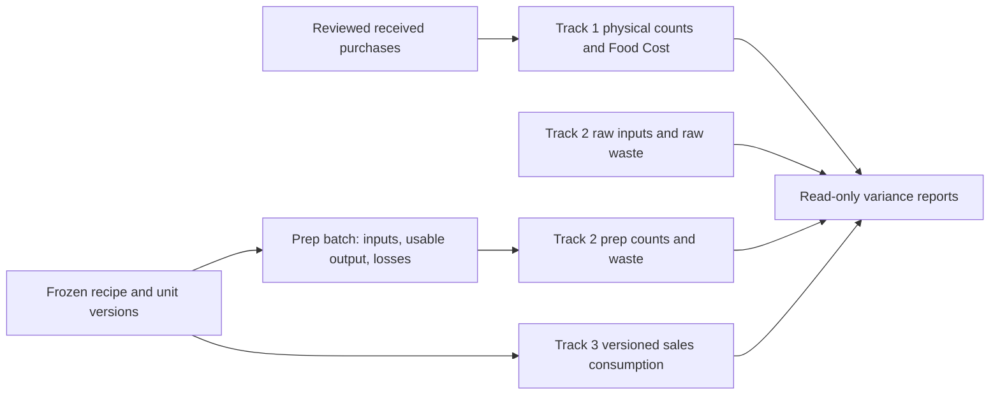

# Prep and waste ledger: relationships and cutover design

Design milestone, October 5, 2026. This defines the next implementation; it does
not install a schema, connect prep/sales writers or change runtime behavior. All
work remains local. Original review and cumulative changes remain available for a
future PR. No operational invoice import or live data inspection accompanies it.

The subsequent [mapping foundation](PREP_MAPPING_FOUNDATION.md) now implements
reviewed identities, unit/recipe versions and legacy crosswalks locally. Batch,
waste, prepared counts, costing, variance and writer cutover below remain proposed.

## Three related measurements

Track 1 stays purchased raw inventory only. Its usage is opening count + net
received purchases − closing count. Food Cost stays explicit opening value + net
received food cost − explicit closing value. Prepared inventory is excluded from
those physical counts under the confirmed policy. Moving raw food into prep can
therefore explain raw depletion in this period even when the prep is sold later.

Track 2 records production, measured prep inventory, documented losses and raw
inputs. Track 3 records independently calculated consumption from sales. Compare
them over the same physical boundaries and units; do not add their usage totals.
Prep production and sales often describe successive stages of the same food.

There are no arrows from prep, waste or sales into the actual purchase/count ledger.
Manager-accepted physical counts remain the only count authority for Track 1.

## Current mapping gaps that affect this design

These are current source findings, not claims from a production runtime test.
The detailed evidence anchors are in `prep_waste_contract.json`.

| Priority | Existing relationship | Gap | Required replacement |
|---|---|---|---|
| High | `dish_lines.qty/uom` → recipe API → prep consumption | The table has `uom`, but `DishLineIn`, save and read adapters omit it. Quantity is treated as portions without a frozen physical conversion. | Explicit ingredient quantity/unit, canonical base quantity and versioned conversion per recipe line. Unknown units hold promotion. |
| High | Preferred supplier product → `_pg_item_derived` → raw deductions | `base_per_purchase_unit` is labeled portions per unit; price comes from the current preferred SKU. Native setup uses physical quantities, so the old portion denominator can be dimensionally wrong. | Keep physical purchase/count units separate from portions; freeze a reviewed cost source separately from the quantity mapping. |
| High | Prep batches and nested recipes → `current_stock` | Recursive flattening deducts raw for prep-within-prep, even when the nested prep was already produced. Quantities are rounded/clamped to zero and missing yield defaults to one. | Consume existing prepared inputs once. Store their ancestry for attribution without another raw movement. Preserve shortages/unknowns for review. |
| High | Container-to-service movement → stock → sales deduction | Container use removes stock by `size`, without a unit profile or measured fill; `apply-sales` also removes stock. Moving to a service station can be treated as consumption twice. | Location transfers balance within a prep identity; measured consumption and theoretical sales remain distinct. Count service locations explicitly. |
| High | Prep history, current recipes and adjustments | Recipe saves delete/replace lines; logs hold JSON usage and mutable references; adjustments replace the entire store collection. History cannot reliably reconstruct the exact recipe, unit, yield and cost basis. | Immutable promoted versions, event lineage and signed corrections; retain legacy source evidence without declaring it verified. |
| Medium | Production/task entry and standing prep items | Direct prep completion/container/sales paths do not wrap all their writes in one transaction. Task completion does use a transaction and row locks, but lacks a durable request key. A `vessel` task is inserted although the schema check allows only `batch/task`. | One idempotent event service used by manager/staff/task routes; task progress and confirmed event commit together. Separate packaging from task kind. |

These older paths still exist. Earlier milestones protected native Track 1 and
labeled legacy operating estimates; they did not implement this new prep ledger.
Their proposed cutover must be tested before native prep is enabled.

## Identities, versions and schema relationships

Use a private `prep_inventory` schema with no public-client grants. The proposed
tables and fields are listed in the adjacent contract. Do not add an alternative
raw inventory master: use `purchasing.item_bases` and canonical store/item IDs for
purchased inputs. Prepared outputs get their own identity because a bag of
appetizers and one raw appetizer can both use `each` while being different things.

- `products` identifies a prepared stock item, canonical base unit and store.
  Immutable product/unit profile versions define bags, portions, pans and usable
  capacities. A container label or nominal volume alone is not a conversion.
- `recipe_versions` gives one output product, standard usable output per batch,
  method, effective/review timestamps and predecessor. Changes append versions.
  Lines refer to exactly one raw identity or a particular prepared input/version,
  with explicit unit, factor, base quantity, measurement basis and evidence.
- `promotion_decisions` seals a reviewed recipe graph, unit profiles and legacy
  source fingerprint. Reject cycles, missing/foreign-store inputs, nonpositive
  yields and incompatible dimensions. Historical costing never follows a mutable
  recipe pointer or substitutes yield/conversion one.
- `batch_events` freezes recipe version, performed time/business date, quantity
  basis, usable output, responsible actor, evidence, request identity and source
  task. Input/output/loss lines retain entered quantities and exact base quantities.
  Measured inputs are distinguishable from standard recipe estimates.
- `movements` contains signed operational quantities by raw/prepared identity and
  location, with batch/waste/transfer/consumption lineage. A parent batch consumes
  an existing prep input; its raw ancestry is explanatory, not another movement.
- `waste_events` identifies the raw/prepared item, stage, reason, quantity/unit,
  evidence, time and optional batch/lot. Loss included in gross batch input links
  to that input instead of adding a second raw withdrawal.
- `prep_count_scopes`, `prep_counts` and `prep_count_lines` capture complete,
  versioned prepared-item/location measurements. They never become Track 1 counts.
  Blank remains unknown; explicit zero is measured. Corrections append versions.
- `cost_snapshots` and `cost_source_lines` retain the selected cost policy, native
  receipt/correction fact-set or prepared lot sources, exact totals, cutoff,
  confidence and evidence. Costs remain analytical. Missing cost can leave a
  valid quantity event with an unavailable cost estimate.
- `report_generations` freezes comparison boundaries, effective and recorded
  cutoffs, event/recipe/mapping versions, completeness and a report hash. A late
  event or correction creates a reviewed replacement, preserving prior reports.
- `legacy_crosswalks` retains old recipe/prep-item/control IDs and source bytes or
  snapshots with scope, mapping version, approval and explicit unresolved status.
  An unverified legacy record is evidence, not a native quantity event.

Enforce composite store/identity foreign keys, exactly-one-source checks, finite
decimals, immutable promoted facts and unique request keys plus fingerprints.
Child lines must be sealed to their parent event transaction so later inserts
cannot alter it. Append exact reversal/replacement events for corrections, with
one effective successor and store locks. Rebuild projections from events; do not
make a mutable `on_hand` field the authority.

## Production, waste and container meaning

For a single-input conversion, capture gross withdrawal, measured usable output,
recoverable byproducts, documented process loss and unexplained remainder. A
20 lb protein input yielding 16 lb usable food can carry 4 lb trim evidence. The
4 lb is already within the 20 lb withdrawal. It is not another 4 lb raw removal.
Recoverable trim is a separate output/byproduct when it will be used.

For recipes mixing weight, volume and count, do not enforce gross inputs equal
output as one summed quantity. Each ingredient keeps its own dimension. A verified
density or item-specific transformation belongs to a frozen profile/recipe, never
a universal weight-to-volume conversion. Compare standard versus measured usable
yield in the output's unit; flag unresolved input/output measurements.

Portioning is the same structure as a recipe: raw inputs leave the raw explanation
projection and prepared units enter Track 2. Packaging and product identity are
explicit. A sauce batch, cut produce, trimmed protein and bags of frozen appetizers
can all use this event structure.

Moving a tub from the walk-in to the line is a location transfer while it remains
countable stock. It does not mean sold or consumed. Transfer lines balance the same
product/unit. If a count excludes service stock, its scope must state that boundary
and transfers across it; full operational counts should include all countable
locations. Record actual fill and number of containers separately from nominal
capacity; do not treat a partially filled pan as full.

## Variance formulas and avoiding duplicate usage

Use aligned half-open physical boundaries, including receipt timing. Store both
performed-at and recorded-at times; a late entry keeps its performed date and marks
affected reports for a new generation. Do not quietly compare UTC calendar windows
with a store's service day. A business-date/timezone policy must be explicit before
operational posting.

For each raw item:

`expected raw closing = Track 1 opening quantity + net received quantity − gross raw batch inputs − standalone raw waste − documented direct raw consumption ± reviewed transfers`

`unexplained raw depletion = expected raw closing − Track 1 closing quantity`

Only add raw waste not already within a gross batch withdrawal. Raw transfers
between stores must reconcile to separate reviewed receiving/accounting documents;
an operational transfer alone cannot create purchases or change Track 1. Missing
direct-service activity yields a partial explanation, not a definitive loss claim.

For each prepared item:

`observed prep depletion = opening prep count + usable production + inbound transfers − outbound transfers − closing prep count`

This includes nested prep inputs, waste and consumption. Subtract those documented
outflows once to find unexplained depletion. Prep count-to-count depletion already
contains waste: reporting waste explains it; subtracting waste again from raw Food
Cost would duplicate an expense.

Sales provides a separate expected consumption projection. Compare it to measured
prep depletion with production, nested use, waste and carryover shown separately.
Do not treat both a measured service-consumption event and its matching Toast
quantity as additive withdrawals. A report must name its selected expectation
basis and disclose unmapped sales/modifiers/returns and missing count coverage.

## Illustrative checks

All examples are invented. Explicit Track 1 count values are inputs, not values
calculated by this design. Reproducible scenarios are in
`examples/prep_waste_scenarios.json`.

| Measurement | Trimmed protein example |
|---|---:|
| Raw opening + purchases − closing | 100 + 20 − 50 = 70 lb actual depletion |
| Track 1 explicit Food Cost | $200 + $40 − $100 = $140 |
| Gross input → usable prep + trim | 60 → 48 + 12 lb; trim is inside the 60 |
| Standalone raw waste and direct raw use | 2 lb + 5 lb |
| Expected raw closing / unexplained depletion | 53 lb / 3 lb |
| Prep opening + production − closing | 10 + 48 − 18 = 40 lb depleted |
| Documented prep waste / sales expectation | 4 lb / 34 lb |
| Remaining prep variance | 40 − 4 − 34 = 2 lb |
| Prepared carryover increase | 18 − 10 = 8 lb |

At this example's verified 1.25 gross-input lb per usable lb, sales accounts for
42.5 raw-equivalent lb; carryover 10, prep waste 5 and the 2 lb prep gap 2.5 together
explain the 60 lb production input. Add the 5 lb direct raw use, 2 lb standalone
waste and 3 lb raw gap to reconcile 70. These raw equivalents allocate explanation;
they do not create more movements. The fixed factor is an example assumption and
cannot be applied generally across different batch yields or opening prep lots.

A batch input cost snapshot of $120 over 48 usable lb gives $2.50 per usable lb.
The 4 lb prep waste has an illustrative $10 analytical allocation. Neither it nor
the trim cost is deducted a second time from the $140 Track 1 Food Cost.

The other scenarios check an eight-appetizer bag identity and a sauce using an
already-produced subrecipe. They explicitly prevent defaulting different `each`
identities to one-to-one and flattening raw ancestry into another withdrawal.

## Cost policy and implementation sequence

The batch cost-source default remains a design choice: reviewed weighted received
cost, latest received cost, or manager-confirmed ingredient costs. Preserve the
policy, included fact IDs, cutoff and source snapshot. Zero-quantity price credits
and corrections require a reviewed net-cost rule; never divide by zero or replace
an unknown cost with zero. Prepared inputs may inherit a specifically assigned
batch/lot cost; without lineage or an agreed pool policy their cost stays unknown.
Late price corrections do not silently reprice historical batches. Publish a new
cost/report generation if reviewed recosting is wanted.

Implement in this order:

1. Add identities, frozen unit/recipe versions and a read-only legacy mapping
   review. Include explicit promotion validation and source preservation.
2. Add the atomic, idempotent batch/input/output/loss service and pure projections;
   test nested inputs, partial containers, unknowns and signed corrections.
3. Add separate waste and prepared count workflows plus aligned variance reports.
4. Replace every legacy prep/task/container writer with that service under one
   explicit cutover flag. Hold old stock/sales mutations in native mode. Do not
   dual-write two balances or promote legacy history automatically.
5. Rehearse whole-database backup/restore with the new private schema and compare
   quantity/cost/report lineage. Validate roles, then enable only in a build pilot.
6. Add versioned Toast menu/modifier mappings and idempotent sales facts later;
   they generate expectations and never accounting purchase/count writes.

The runtime prep cutover, new tables/APIs, costing-policy selection, container
profiles, cross-store transfer policy, joint Scheduling/Operations interfaces and
Toast integration are not implemented by this design milestone. Keep Jeff's
Inventory authority, Jay's Scheduling and Rudd's Operations boundaries intact.
