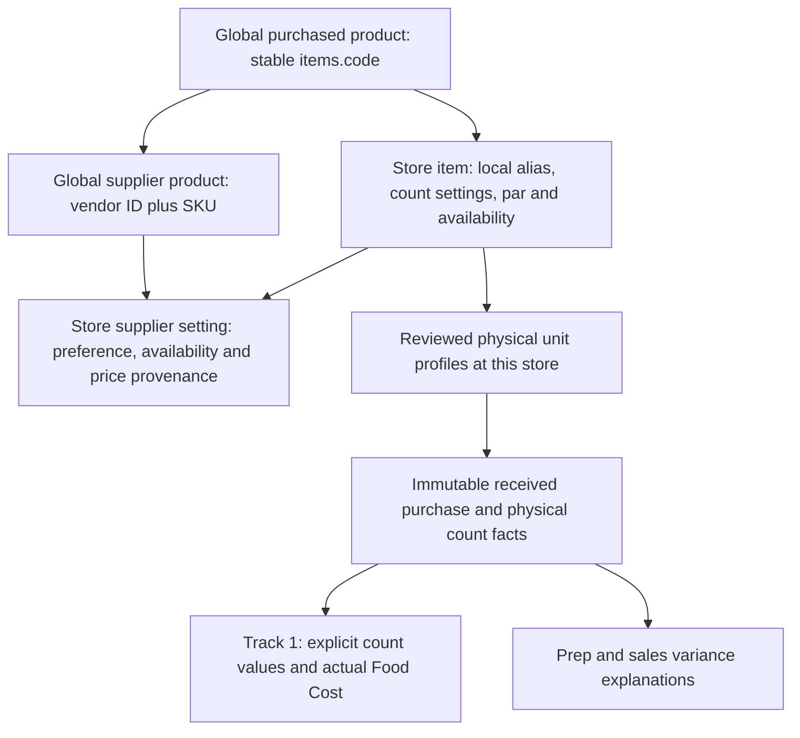

# Shared purchased-product catalog

Local milestone, October 6, 2026. All changes are uncommitted and unpublished. The migration was applied only to disposable test databases. Real invoice samples were not imported.

## Identity and ownership

Existing `items.code` values are stable global identities, even if an older code contains a store prefix. They are not renamed. `vendor_items` retains its global unique vendor/SKU identity and one purchased-product relationship. Each restaurant explicitly links the same product; it does not create another supplier SKU pointing to a duplicate item.

`store_items.control_number` is a separate display/operational alias unique within the store. The browser retains the global `itemCode` through reads and writes; the alias cannot replace the canonical key. Migration backfill preserves the existing browser aliases, including the `papa` database / `papa_leonis` app distinction. No products are automatically merged by name, description or similar packs.

`purchasing.store_vendor_items` owns supplier preference, availability, exact NUMERIC planning price, price timestamp and source independently for each store. Composite foreign keys prevent attaching a supplier SKU to the wrong product or store membership. Existing settings are backfilled exactly for current store/product links; explicit new links have unknown local prices and no price provenance. Removing a supplier choice disables it locally and retains its identity, price and history. It does not disable another restaurant's choice.

Store flags, pars and count settings remain independent. Linking a product creates no inventory stock, opening/closing value, fixed accounting base, native unit profile, invoice, posting, prep event or POS sale. The explicit count factor entered during linking is catalog metadata; native physical profiles must still be reviewed independently at that restaurant. The catalog base unit is a reference and can contain a legacy label; it does not establish a verified accounting conversion.

## Review and concurrency boundaries

- `GET /api/pg/catalog/{store}` returns active purchased-product identities and supplier pack evidence with a catalog hash and the store revision. It exposes shared product metadata, not another restaurant's prices, stock or counts.
- `POST /api/pg/catalog/{store}/links` requires explicit product/SKU selection, identity confirmation, current `If-Match`, current catalog hash, a unique store alias and a positive finite physical metadata factor. Missing membership, wrong SKU, duplicates, stale hash/revision and alias collisions are held without partial writes.
- Catalog create, replace, retire and link commands take a catalog transaction lock before store revisions. Repeated/racing links cannot create duplicate memberships. A link changes the destination store revision, so stale whole-list replacements cannot remove it.
- Once a product is shared, ordinary store editing cannot change its global product or supplier pack fields. Backend checks hold these edits, and Item Setup disables the corresponding fields. Location flags, pars, prices, supplier preference and availability remain editable. A dedicated reviewed global product/pack amendment workflow remains future work; these changes are held rather than silently propagated.
- New native order lines require canonical product identity, store active/order flags, matching order supplier/SKU and local supplier availability. Rejection rolls back a new order header too. Historical receipt resolution retains global SKU IDs and immutable unit/profile/source facts even after a choice is unavailable.
- The link form retains input on failure, verifies acknowledgement identity and revision, ignores completion after leaving the keyed restaurant, and holds automatic resubmission after uncertain outcomes. In-memory drafts do not survive logout or app reload.

Broader order/list transitions, direct legacy operating APIs, global vendor edits and general idempotency/versioning remain R07/R17 work. This milestone does not claim all catalog/order races or global metadata administration are complete.

## Enablement and recovery

Apply `migrations/20261006_shared_catalog.sql` after native purchase and order-receiving setup. The SQL deliberately fails if existing aliases conflict or existing prices violate the new finite/nonnegative contract; it does not guess which records to merge or discard.

Both example flags remain false: `CATALOG_MAPPING_ENABLED` and `REACT_APP_CATALOG_MAPPING`. Backend shared mode requires PostgreSQL, native purchases and Actual Inventory. Apply and enable it together in a controlled build/deployment step. If the shared schema is installed while shared mode is disabled, catalog reads/writes and order line writes are held with 503 rather than reverting to global prices/settings. Do not use disabling this flag as a rollback after adoption; restore/reconcile the database and application together. No live enablement occurred here.

The review package contains current frontend, catalog/receiving/entry and offline regression results, plus a fresh whole synthetic database dump/restore. The restore verifies aliases, independent supplier settings and identical actual accounting reports, alongside rows/schema/ACL checks. Its fixture loads purchased-inventory schemas, not the entire prep operating cutover; earlier prep recovery proof remains in the embedded prior snapshots. Managed-service recovery and production/browser behavior are not claimed.

## Review status and PR checkpoint

R10 is fixed locally for explicit shared product/SKU linking and independent store settings. R05, R11, R12, R15 and R18 retain their remaining unit, menu recipe, effective price history, mapping and broader retirement scope. Track 1 accounting is unchanged; prep/waste and sales remain independent variance explanations.

This is a useful draft PR checkpoint for the cumulative data-integrity foundation, before broad prep/task/count/container cutover. It is a review checkpoint, not release readiness. Remaining unit/menu cost validation and effective price policy can be reviewed as subsequent work, followed by backend transition/concurrency and operating cutover. Preserve the full original review and prior snapshot evidence in the draft. Publishing requires the user's authorization.
